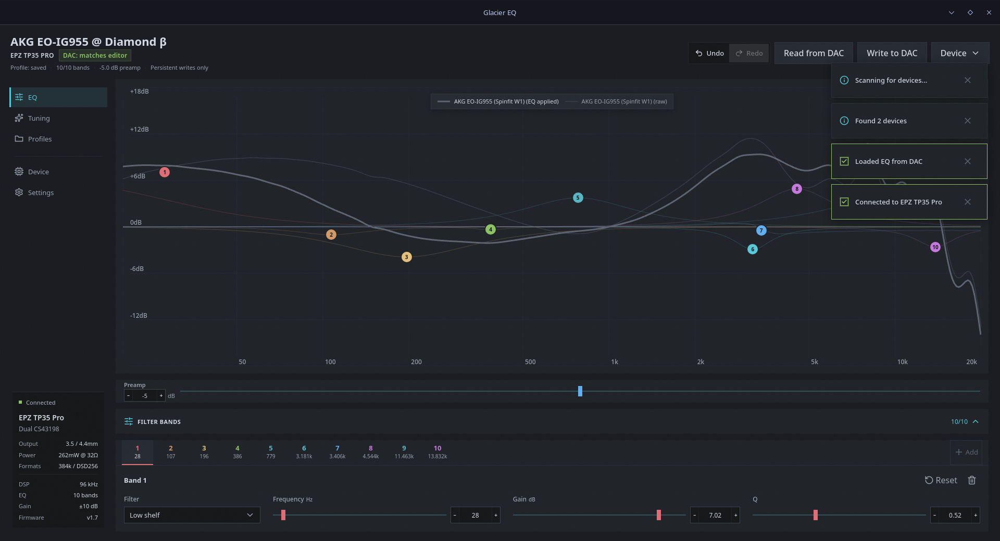

<h1>
  
  Glacier EQ
</h1>

<div>
  <a href="https://github.com/Bukutsu/glacier-eq/releases/latest"></a>
  <a href="https://github.com/Bukutsu/glacier-eq/blob/main/LICENSE"></a>
</div>

Tune how your earphones sound. Glacier EQ edits the parametric EQ on USB DAC dongles — EPZ TP35 Pro, TRN Black Pearl, Moondrop Dawn Pro, FiiO KA/JA11, Truthear KEYX, JCally, iBasso, Fosi Audio, and more. Adjust bass, treble, whatever fits you. It saves directly on the dongle.

No account, works offline.

[Try it in your browser](https://bukutsu.github.io/glacier-eq/) (Chrome or Edge) · [Download for desktop and Android](https://github.com/Bukutsu/glacier-eq/releases)



## Will it work with mine?

Plug your DAC in and check if it shows up in the app.

**Tested:**
- EPZ TP35 Pro (TP35Pro)
- TRN Black Pearl

**Supported (untested):**
- Moondrop Dawn Pro / Dawn Pro 2
- FiiO JA11
- FiiO KA series (KA5, KA13, etc.)
- Truthear KEYX
- JCally JM20 / JM20 Pro
- JCally JM12
- Fosi Audio DS2
- iBasso DC04 Pro
- Audiocular Aura
- Other Savitech/Walkplay-based DAC dongles

[See the full list on the wiki](https://github.com/Bukutsu/glacier-eq/wiki/Supported-Devices).

## How to use

1. Plug in your DAC and open Glacier EQ.
2. Pick your DAC, hit **Connect**, then **Pull**.
3. Move the sliders till it sounds right, then hit **Push** to save.

That's it. The sound stays on your dongle, even on other devices.

Save favorites as profiles so you can switch back anytime.

## Hardware developer CLI

The workspace CLI can inspect a connected DAC and send raw HID reports for protocol testing:

```sh
cargo run -p glacier-core --bin glacier-eq-cli -- hardware list
cargo run -p glacier-core --bin glacier-eq-cli -- hardware raw \
  --device 3302:43e6 --report-id 4b --data 80 0c 00 --read-ms 250 --yes
```

Raw writes require `--yes`; use `--read-ms 0` when no response should be read. The report ID is supplied separately and the data accepts space-, comma-, colon-, or compact hexadecimal bytes.

## Problems connecting?

[Linux setup and troubleshooting](https://github.com/Bukutsu/glacier-eq/wiki/Troubleshooting)

## Support

If you find Glacier EQ useful, give it a star or support/sponsor on [GitHub Sponsors](https://github.com/sponsors/Bukutsu) or [Ko-fi](https://ko-fi.com/bukutsu) :3

## Links

- [Wiki](https://github.com/Bukutsu/glacier-eq/wiki) — device list, install options, command line tools, building from source
- [Releases](https://github.com/Bukutsu/glacier-eq/releases) — downloads
- [Issues](https://github.com/Bukutsu/glacier-eq/issues) — bugs and requests

Glacier EQ is licensed under GPL-3.0-only. See [LICENSE](LICENSE).
